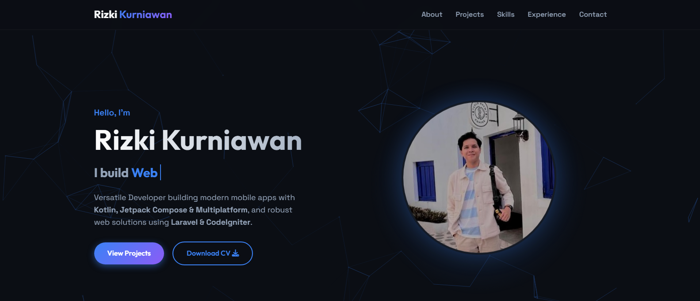

# Portfolio Website



Welcome to the source code of my personal portfolio website. This static website serves as a showcase for my projects, skills, and professional experience as a **Mobile & Backend Engineer**.

Designed with a modern aesthetic, it features responsive layouts, interactive elements, and a smooth user experience to highlight my work in **Android Development (Kotlin/Compose)** and **Web Backend (Laravel/CodeIgniter)**.

## 🚀 Live Demo

Check out the live version here: **[rizkikurniaa.github.io](https://rizkikurniaa.github.io)**

## ✨ Features

- **Responsive Design:** Fully responsive layout that works seamlessly on desktop, tablet, and mobile devices.
- **Dynamic Animations:**
  - 🌌 **Particle Background:** A custom HTML5 Canvas animation with connecting particles.
  - ⌨️ **Typing Effect:** Dynamic text typing in the hero section.
  - 📜 **Scroll Reveal:** Elements fade and slide in as you scroll down the page.
- **Interactive UI:**
  - Smooth scrolling navigation.
  - Modal popups for detailed project views and certificate previews.
  - Glassmorphism effects and modern styling.
- **Performance:** Lightweight, static HTML/CSS/JS with no heavy framework dependencies for fast load times.

## 🛠️ Tech Stack

This project is built using pure vanilla web technologies to ensure maximum control and performance:

- **HTML5:** Semantic markup for better accessibility and SEO.
- **CSS3:** Custom styles, Flexbox, Grid, and CSS Variables for theming.
- **JavaScript (ES6+):** Vanilla JS for logic, DOM manipulation, and animations.
- **FontAwesome:** For vector icons.
- **Google Fonts:** Typography (Outfit & Space Grotesk).

## 📂 Project Structure

```bash
rizkikurniaa.github.io/
├── assets/
│   ├── css/
│   │   └── style.css       # Main stylesheet
│   ├── js/
│   │   └── script.js       # Main logic and animations
│   ├── images/             # Project screenshots and assets
│   └── certificates/       # Certificate images
├── index.html              # Main HTML entry point
└── README.md               # Project documentation
```

## 💻 How to Run Locally

Since this is a static website, you don't need a backend server to run it.

1. **Clone the repository:**
   ```bash
   git clone https://github.com/rizkikurniaa/rizkikurniaa.github.io.git
   ```

2. **Navigate to the project directory:**
   ```bash
   cd rizkikurniaa.github.io
   ```

3. **Open the site:**
   - Simply double-click `index.html` to open it in your browser.
   - OR use a live server extension (like Live Server in VS Code) for a better development experience.

## 🤝 Contact

Feel free to reach out if you have any questions or want to collaborate!

- **LinkedIn:** [Rizki Kurniawan](https://linkedin.com/in/rizkikurniaa)
- **GitHub:** [rizkikurniaa](https://github.com/rizkikurniaa)

---

&copy; 2026 Rizki Kurniawan. All rights reserved.
